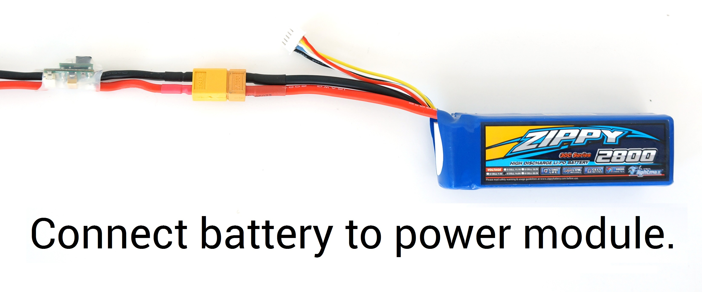
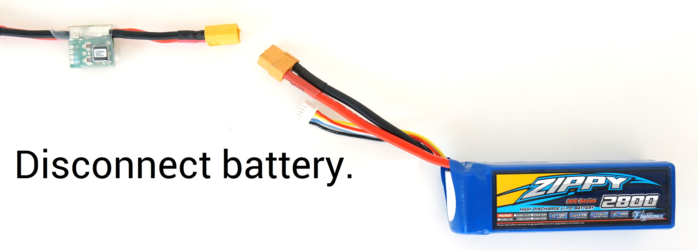

# Calibración ESC 

Los controladores electrónicos de velocidad son los responsable de regular los motores a la velocidad requeridad por el autopiloto. La mayoria de los ESCs necesitan calibrarse para conocer los valores *PWM* máximos y mínimo que el controlador de vuelo debe mandar. Esta página proporciona información para calibrar los ESCs.

#### Calibrando todos a la vez

######Chequeo de seguridad!

Antes de calibrar los ESCs, por favor asegurate de que tu multicóptero no tiene puestas las hélices, que APM no este encendido y la bateria LIPO esta desconectada.

- Enciende el transmisor y punto el *stick* del *throttle* en el valor máximo.

- Conecta la bateria (LiPo). Los LED del autopiloto se iluminaran con un patrón ciclico. Esto significa que esta listo para entrar en el modo calibración de los ESC la próxima vez que te conectes.

- Con el *stick* del *throttle* en el valor máximo, desconecta y vuelve a conectar la bateria.

- El autopiloto esta en el modo calibración de ESC. (Los LEDs rojo y azul de APM tiene que estar parpadenado de forma alterna como un coche de policia).

- Espera a que los ESCs emitan un tono musical, el número de pitidos indicar el número de celdas de la bateria (es decir, 3 para 3S, 4 para 4S) y adicionalmente dos pitidos para indicar que el valor máximodel *throtlle* ha sido capturado.

- Pon el *stick* del *throtlle* abajo a su posición mínima.

- Los ESCs deben emitir un tono largo indicando que el valor mínimo del *throtlle* ha sido capturado y la calibración ha sido completada.

- Si un tono largo indicando que la calibración ha sido completada satisfactoriamente ha sido escuchado, los ESC están *vivos* ahora y si mueves el throtlle los motores deben girar. Testea que los motores girarn moviendo levemente el *throtlle* y devilviendolo a la posición mínimo.

- Deja el throtlle a su valor mínimo y desconecta la bateria para salir del modo calibración de ESC.
