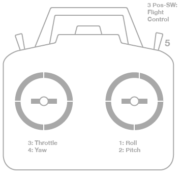

# Calibración del radiocontrol

http://copter.ardupilot.com/wiki/initial-setup/configuring-hardware/#Calibrate_radio_control

Enciende el radiocontrol. Verifica que el transmisor esta conectado con el multicóptero y los *joysticks* estén en su sitio.

#### Modos
- **Modo 1**: El *stick* derecho puede controlar el *pitch* y *yaw*, el *stick* derecho controlará el *throttle* y el *roll*
- **Modo 1**: El *stick* derecho puede controlar el *throttle* y *yaw*, el *stick* derecho controlará el *pitch* y el *roll*

Para cualquier tipo de transmisor, dispondrá de un interruptor de 3 posiciones que debe ser conectado al canal 5 para controlar los distintos modos de vuelo.

Opcionalmente el canal 6 del transmisor puede ser configurado para realizar ajustes durante el vuelo. El canal 7 y 8 se pueden configurar para realizar operaciones auxiliares. Por ejemplo el control del gimbal.

Mueve las palancas de control y los interruptores es su transmisor a los límites de recorrido. Su transmisor debe causar los siguiente cambios:

- **Canal 1**: low = izquierda roll , high = derecha roll.
- **Canal 2**: low = pitch arriba, high=pitch abajo back.
- **Canal 3**: low = throttle abajo (off), high = throttle arriba.
- **Canal 4**: low = izquierda yaw, high = derecha yaw.
